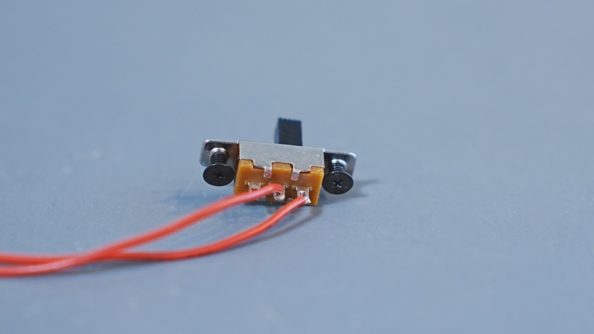
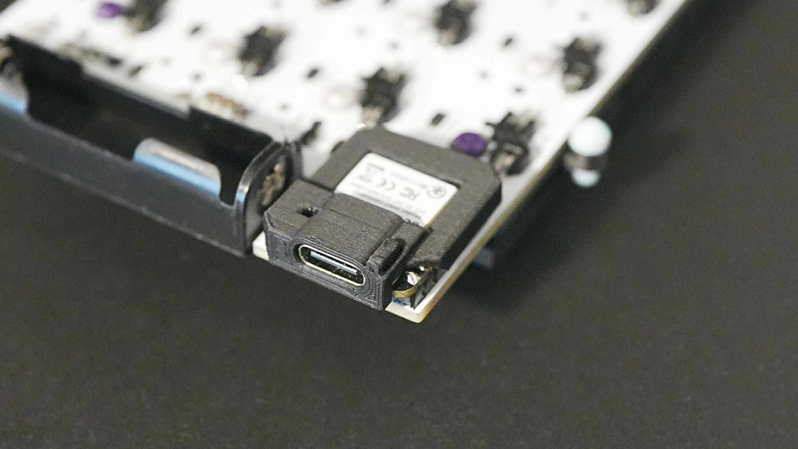
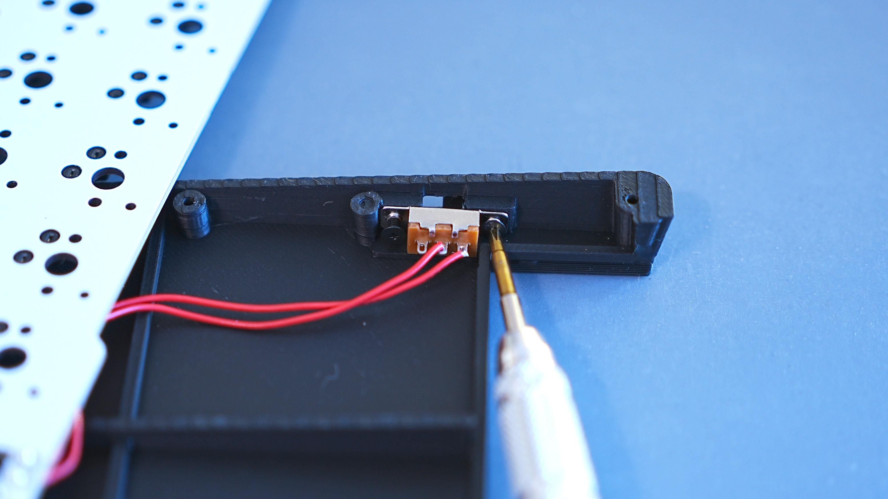
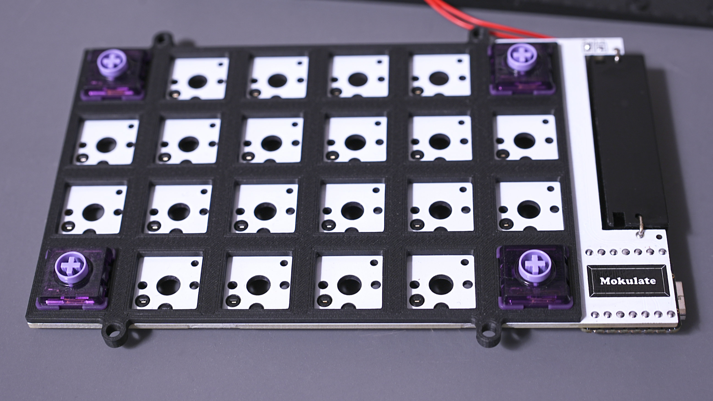

---

## 電源スイッチの取り付け

1.  スライドスイッチを、**黒色のM2ネジ**（2本）を使って**ボトムケース**に取り付けます。
    
    電線2本がはんだ付けされている端子が電池ボックス側にくるようにしてください。  
    

---

## キースイッチをはめる

1.  メイン基板の上にスイッチプレートを載せます。スイッチプレートは突起があるほうを下に向けてください。
2.  キースイッチをはめます。基板とスイッチプレートは、キースイッチを介して接合するような仕組みとなっています。
3.  まずは画像のように端からはめていき、最後に中央部分をはめるとうまくいきます。
    

---

## ケースの組み立て

1.  **ボトムケース、tadpoleピン、スイッチプレート、トップケース（木製）** の順に重ねます。
    
2.  **銀色のM1.7ネジ**（6本）を使って裏側から固定します。
    
    強く締め付けると、トップケースのねじ山が潰れてしまう恐れがあります。  
    電動ドライバーではなく手回しドライバーを使ってゆっくりと締めてください。ネジが動かなくなる程度で、**ほどほど**にしておいてください。
3.  組み立てた状態でトップケースの四隅を上から軽く押してみてカタ付きがなければ完成です。  
    あとはお好みのキーキャップを取り付けてください。

&nbsp;

:::note[四隅を押すとカタつく場合（トップケースの反り対策）]
トップケースは木製のため、製造時は平面になるよう加工していますが、
時間の経過や保管環境（湿度・温度）によって、わずかに反りが発生する場合があります。

反った状態のままネジを締め付けると、トップケースに引きずられて
ボトムケース側も歪み、結果としてカタつきが発生することがあります。

以下の手順で調整を行ってみてください。

1. 組み立てた状態で机に置き、カタつく対角の2点を確認します。
2. その2点の **銀色のM1.7ネジを少しだけ緩め** ます。
3. **付属のスペーサーを1枚**、該当するネジ位置のどちらかに挟んで再度固定してください。
4. それでも改善しない場合は、**対角位置にもう1枚スペーサーを追加**して調整してください。  
   

無理にネジを締め込まず、「カタつかない位置」で止めるのがポイントです。  
多少ネジが緩く感じても、使用上問題はありません。

※ スペーサーを使用する場合は、**付属しているスペーサーのみ**をご使用ください。  
※ それでも大きな歪みが解消しない場合は、無理に使用せずご相談ください。
:::

