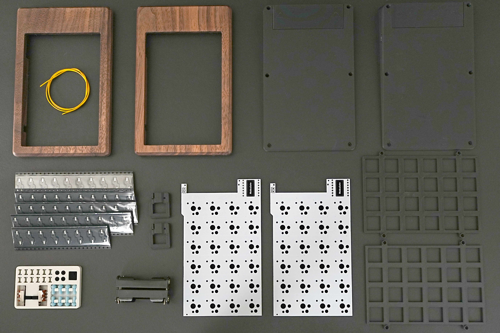

---

## キットに含まれている部品

| 名前 | 数 | 備考 |
|:---|---:|:---|
| メイン基板 | 2枚 | 左右共通 |
| 木製トップケース | 2個 | 左右共通 | 
| スイッチプレート| 2個 | 左右共通 |
| 電池カバー | 2個 | 左右共通 |
| マイコンカバー | 2個 | 左右共通 |
| ボトムケース| 1組 | |
| 電池ボックス | 2個 | |
| スペーサー | 6個 | |
| スライドスイッチ | 2個 | |
| Tadpole Pin | 8個 | 一番やわらかい50A |
| ネジ M2 | 4本 | スライドスイッチ取り付け用|
| ネジ M1.7 | 12本 | ケース固定用 |
| 電線 | 1本 | スイッチの空中配線用|

&nbsp;

:::tip
固めの Tadpole Pin がお好みの方は Greenkeys Shop にてお買い求めください。  
https://shop.green-keys.info/products/tadpole
:::

&nbsp;

## 別途手配していただく部品

| 名前 | 数 | 備考 |
|:---|---:|:---|
| Xiao nrf52840 | 2個 | | 
| ロープロファイルキースイッチ (Choc V2互換) | 48個 | | 
| ロープロファイルキーキャップ | 48個 | すべて1u | 
| 単四電池 | 2本 | アルカリ or 充電 | 

## 必要な工具類

| 名前 | 備考 |
|:---|:---|
| はんだごて | 温度調整可能だと◎|
| はんだ | |
| ピンセット | |
| 精密ドライバー0番 |  |
| ニッパー/ペンチ | 電池ボックスの足切りや電線処理に使用|
| USB type-Cケーブル | 1本 | ファームウェア書込みに必要 | 

