:::note
Mokulateはボトムケースを除き左右とも同じパーツとなっております。  
組み立て時は左右を気にせずに同じ作業を2回繰り返してください。
:::

---

## 電池ボックスのはんだ付け

1. ラジオペンチを使って電池ボックスの足を折り曲げます。      
1-1. 根元をラジオペンチの先端で掴みます  
    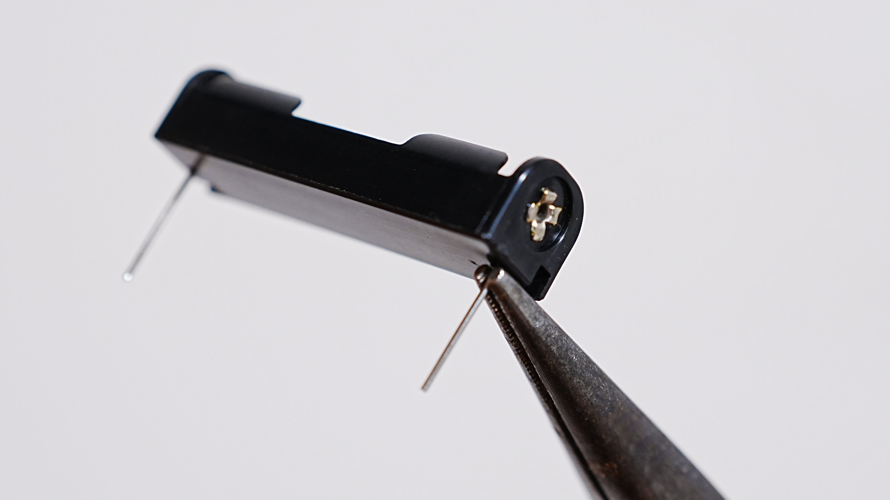
1-2. ラジオペンチで掴んだまま反対の手で外側に折り曲げます  
    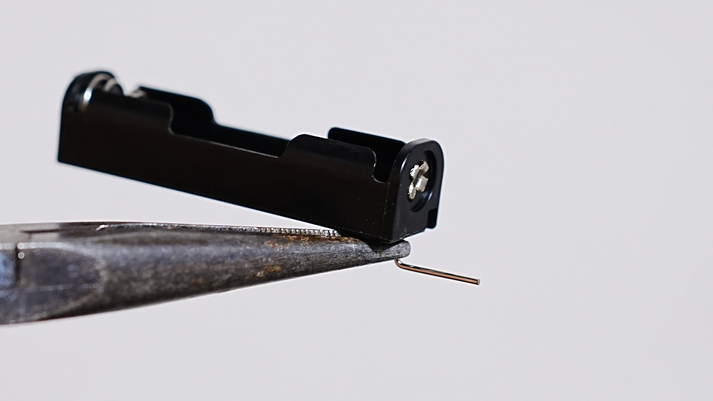
1-3. 根元を外側に折り曲げます  
    

2. 反対側の足も同じように折り曲げます。

3. 電池ボックスをメイン基板に差し込みます。基板に書いてある極性（＋/ー）と電池ボックスの極性を合わせてください。  
    

4. 高さ合わせのためにトップケース、スイッチプレート、メイン基板の順に重ねます。   
スイッチプレートは突起が出ているほうを上に向けてください。
    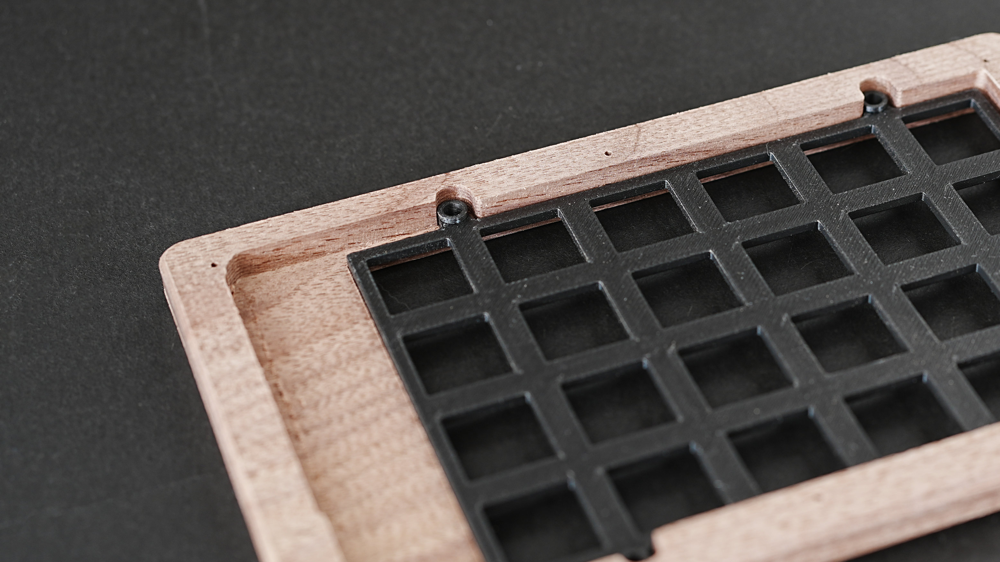
    

5. 電池ボックスをはんだ付けします。  
左側のように斜めになってしまった場合は、はんだを温めながら右側の写真のように垂直に調整してください。
    

6. 余分な足をニッパーで短く切ります。消しゴムで押さえるのが安全です。
    <blockquote class="twitter-tweet">
指で押さえて切る人多いけど… 消しゴムで押さえるのオススメだからやって欲しいし広まって欲しい <a href="https://t.co/F6qBkT1Q46">https://t.co/F6qBkT1Q46</a> <a href="https://t.co/pia4FrIQtp">pic.twitter.com/pia4FrIQtp</a>
&mdash; mass (@mass_0X00) <a href="https://twitter.com/mass_0X00/status/1964227813588029549?ref_src=twsrc%5Etfw">September 6, 2025</a></blockquote>  

7. トップケースとスイッチプレートはいったんメイン基板から外しておいてください。

---

## キーソケットのはんだ付け

キーソケットを基板裏面に実装します。

1.  片方のパッドに事前にはんだを盛ります（予備はんだ）。
    

2.  キーソケットをシルク表示に合わせて正しい向きで基板にはめ込みます。  
ピンセットでキーソケットを軽く押さえ、あらかじめ載せておいたはんだを溶かしてソケットを固定します。
    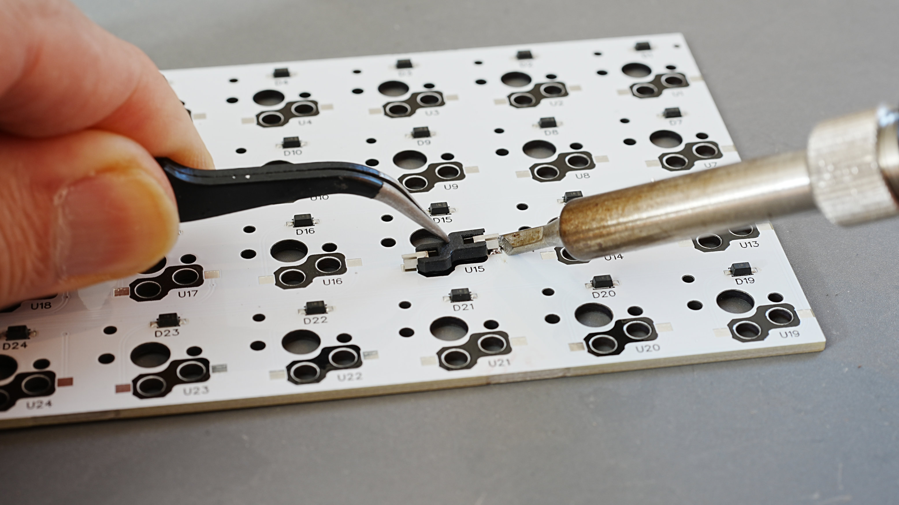

3.  固定できたら、反対側のパッドにもはんだを流して固定します。

---

## スライドスイッチの電線準備

このスライドスイッチが電源スイッチとなります。

1.  付属の電線（2本）を適切な長さに切って、両端の被覆を剥きます（約10〜12cm推奨）。
    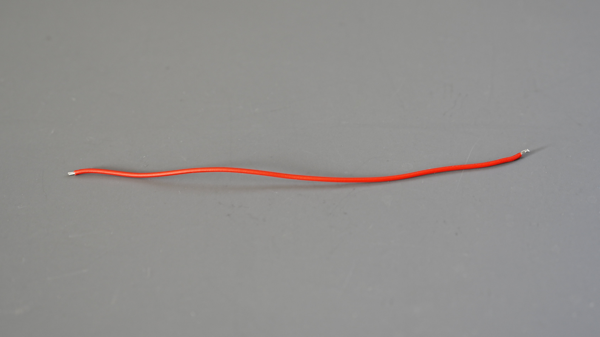

2.  スライドスイッチの足のうち、**真ん中の足**と、左右どちらかの**2箇所**に、切った電線をはんだ付けします。
    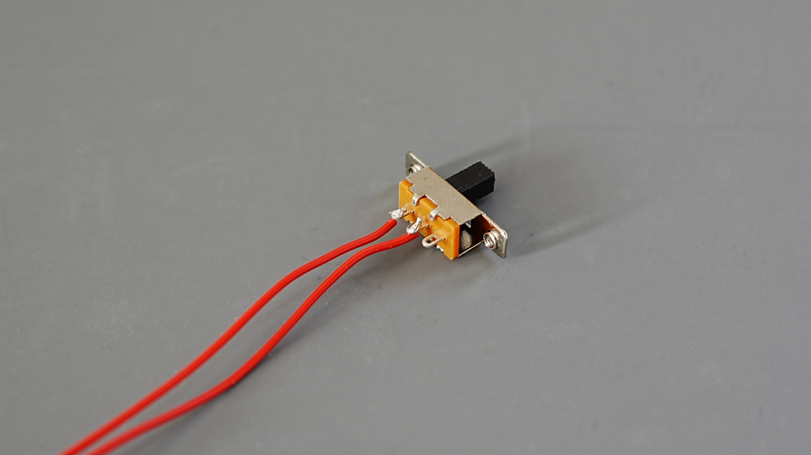

3.  電線の反対側を、**メイン基板裏面にある電源スイッチ接続用パッド（Switch）** にはんだ付けします。 極性はないので、どちらパッドに繋いでもOKです。  
    
抜けないようにマスキングテープで止めるとはんだ付けしやすいです。  
    

---

## マイコン（Xiao nRF52840）のはんだ付け

1. Xiao nRF52840に付属しているピンヘッダを、**まず基板のマイコン実装箇所に差し込みます**。
    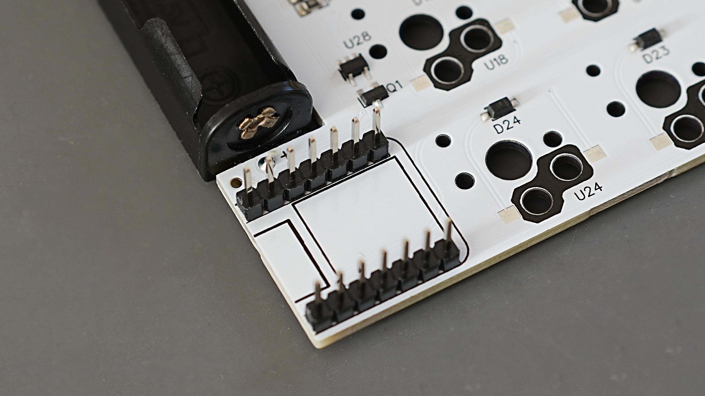
2. そのピンヘッダの上に、Xiao nRF52840を載せます。
    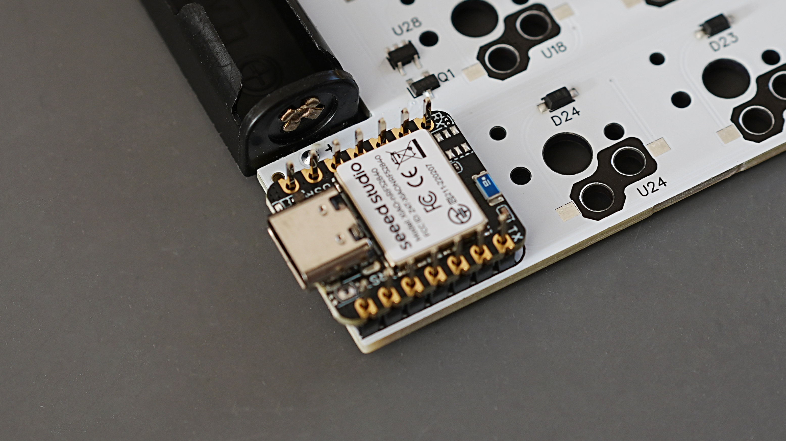
3. ピンヘッダの両端2箇所だけはんだ付けします。
    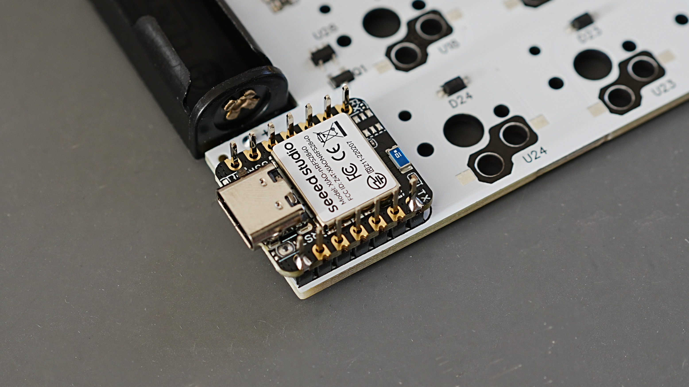
4. ピンヘッダとマイコンを抜いてから逆向けに差し込んで、再び両端2箇所だけはんだ付けします。
    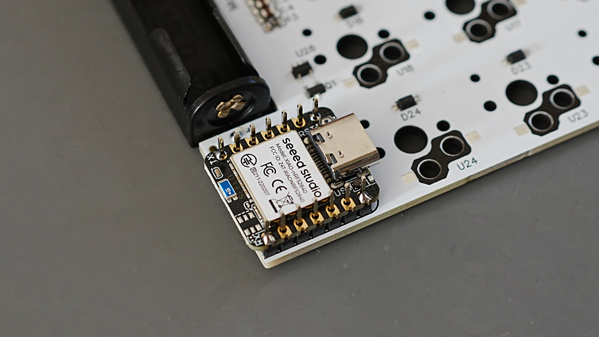
5. 基板からピンヘッダとマイコンを外して、残りの10箇所をはんだ付けします。
    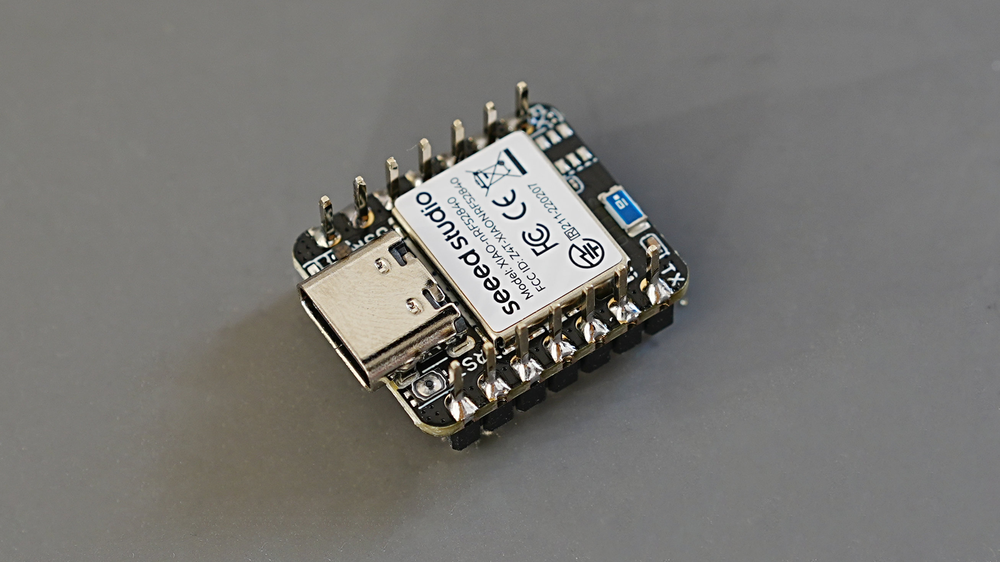
6. 余分な足をニッパーで短く切ります。再び消しゴムの出番です。
    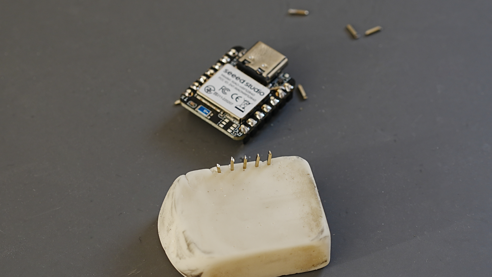
7. 基板にマイコンを差し込んでマスキングテープで固定します。
    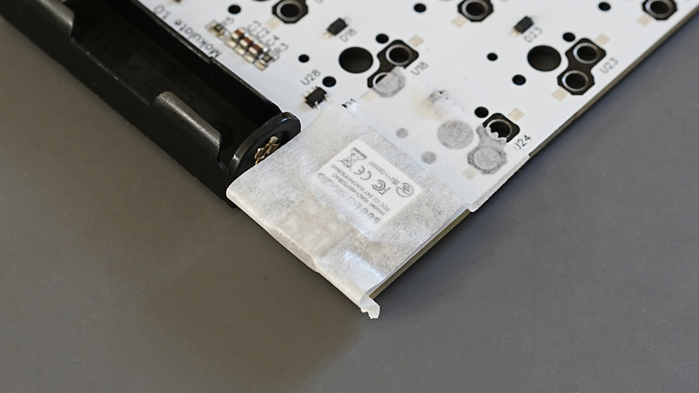
8. 四隅をはんだ付けして、隙間がないか確認します。
    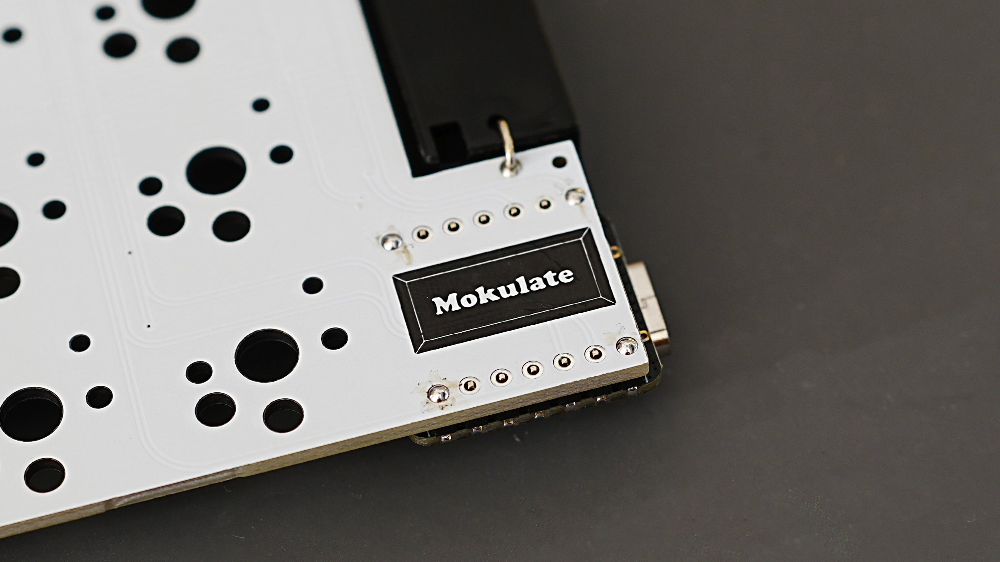
    
9. 残りの10箇所をはんだ付けすれば完成です。
    
    

以上で片手分のはんだ付けが終了です。**同じ作業をもう一度繰り返してください。**

