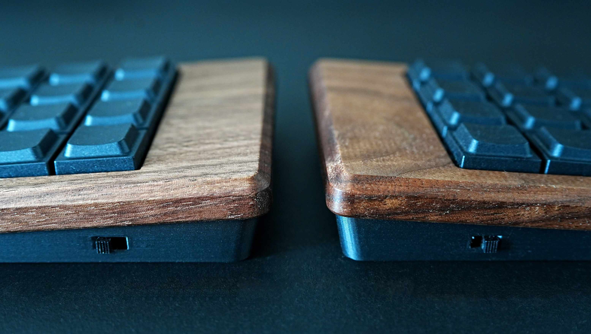
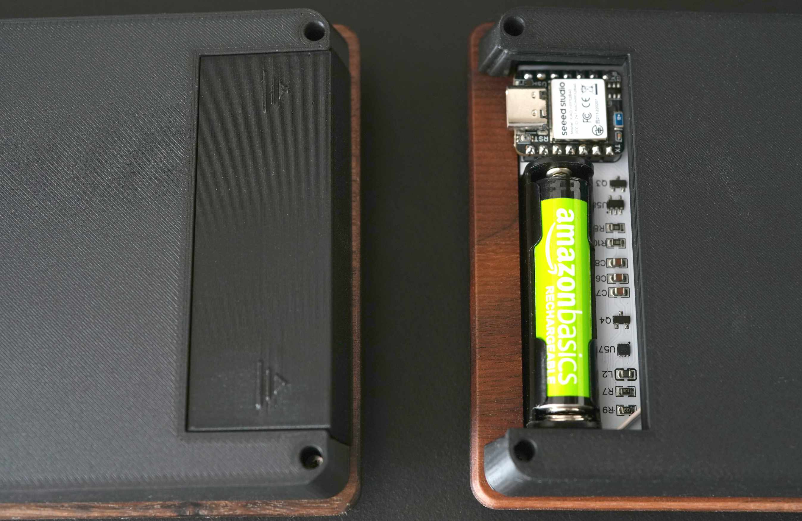
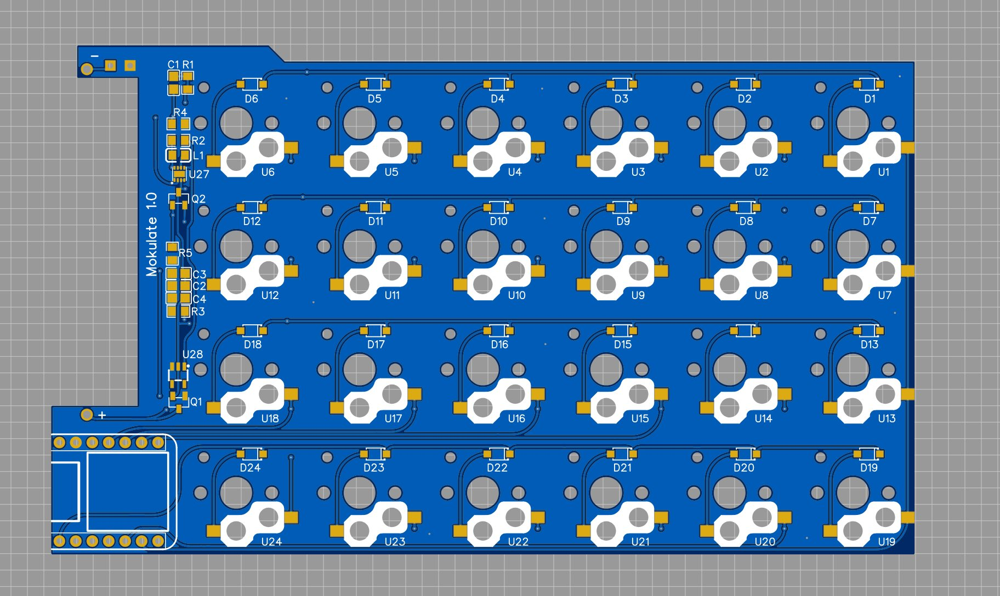

Mokulateは、一つの挑戦から始まりました。  
それは **「木製ケースの製作工程を最適化し、理想の仕上がりを追求する」** ことです。

これまで数多くの木製ケースを製作してきましたが、既存の基板に合わせる設計では、どうしてもCNC加工後の手作業（穴あけや微調整）が発生し、品質のバラつきや失敗のリスクが伴いました。

「それなら、最初から木製ケースに最適化した基板を作ればいいのではないか？」
この逆転の発想が、Mokulate誕生の原点です。

&nbsp;

---

## 木のために設計された構造

設計の最大の目標は、CNC加工後の手作業を極力減らし、木の質感を最大限に引き出すことでした。

### 1. 横穴のないフラットな造形
従来のケースで課題だったケーブル用の横穴を廃止しました。
マイコンやスイッチを基板裏面に配置し、ボトムケース側に収めることで、トップケースは「ただ被せるだけ」の美しいフラットな面を実現。
これにより、木工の仕上げ工程である面取り作業の精度が飛躍的に向上しました。

### 2. 木製トップ × 3Dプリントボトム
キーボードの「顔」となる上部は温かみのある**天然木**、機能を集約する下部は精密な**3Dプリントパーツ**という2ピース構造を採用。それぞれの素材の長所を活かしたハイブリッド設計です。

&nbsp;

---

## 妥協のないコンセプト

木製ケースという外見だけでなく、キーボードとしての「使い心地」と「憧れの機能」を凝縮しています。

* **6x4 オーソリニア配列**  
    格子状の配列は、指の動きに無理がなく、初めて自作キーボードに触れる方でも馴染みやすい構成です。
* **デフォルト・テンティング**  
    手首が自然な角度になるよう、標準で4度の傾斜（テンティング）を設けました。
* **Tadpoleマウント**  
    基板をシリコン製のパーツで支えるマウント方式を採用。木製ケースの響きと相まって、独特の柔らかな打鍵感を楽しめます。
* **単四電池1本による完全無線**  
    デスクの上をスッキリさせるため、無線化と電池駆動にこだわりました。電池蓋はリモコンのような親しみやすさを意識して設計しています。

&nbsp;

---

## 左右同一基板と「怪我の功名」

Mokulateは、左右で「全く同じ片面実装基板」を使用しています。

一般的に、左右共通の基板（リバーシブル基板）は、組み立て時に「ジャンパはんだ」や「マイコンの裏表の確認」といったコツが必要なものが多いです。しかし、Mokulateはハードウェア的な工夫が一切不要で、誰でも迷わず組み立てられます。

実はこれ、開発中のミスから生まれた「怪我の功名」です。 初期ロットで左手基板の設計ミスをしてしまい、手元に右手基板だけが残った絶望的な状況で、「右手基板でもソフトで制御すれば左手として動かせるのでは？」と思いつきました。

格子状に整列しているオーソリニアだからこそ成立したこのアイデアにより、結果として「コストを抑えつつ、組み立てやすさも向上する」という、合理的な設計にたどり着くことができました。

&nbsp;

---

## おわりに

木という素材は、一つとして同じ木目がありません。  
Mokulateを通じて、天然木ならではの温もりと、緻密に設計されたタイピング体験を届けることができれば幸いです。

